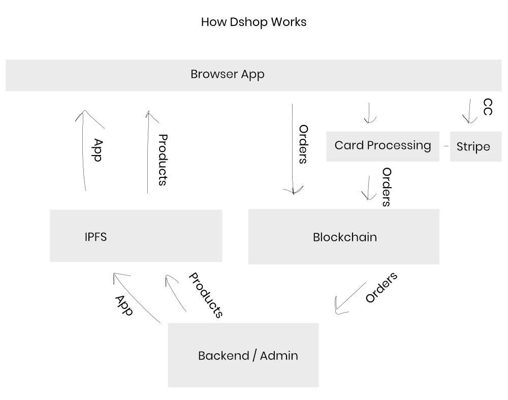

# dshop

dshop is a decentralized e-commerce store served entirely from IPFS. dshop stores can accept credit cards, etherium, and ERC20 coins.

When using cryptocurrencies, the user facing dshop requires no connection to the backend. Loading the site, products, and submitting orders all happens over IPFS and the blockchain. This decoupling also makes for an extremely responsive and user friendly shopping experience.

Currently there are few docs on working with the dshop.

Details:

- [Order Flow](backend/docs/order.md)

Other docs:

- [Main README](../README.md)
- [Backend README](backend/README.md)
- [Backend docs](backend/docs/README.md)

