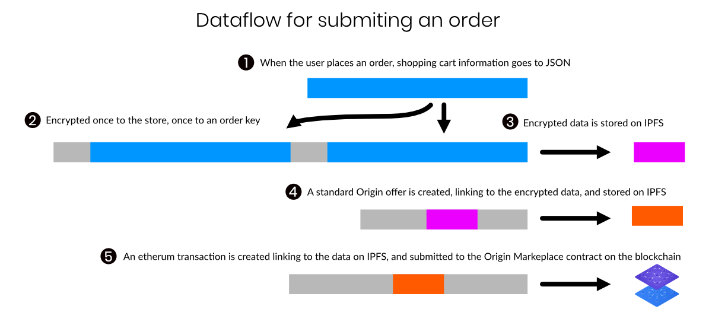

# dshop Order Flow

## 1. Cart contents

    cart = {
        "items": [
            {
                "title": "Origin Logo Tee",
                "product": "origin-logo-tee",
                "quantity": 1,
                "variant": 0,
                "price": 2000
            },
            {
                "title": "Cut Out The Middleman Baseball Tee",
                "product": "cut-out-the-middleman-baseball-tee",
                "quantity": 1,
                "variant": 0,
                "price": 2000
            }
        ],
        "instructions": "",
        "subTotal": 4000,
        "discount": 0,
        "donation": 0,
        "total": 4000,
        "paymentMethod": {
            "id": "stripe",
            "label": "Credit Card"
        },
        "discountObj": {},
        "userInfo": {
            "email": "nasa@example.com”,
            "firstName": "Douglas",
            "lastName": "Hurley",
            "phone": "5553332222”,
            "address1": "12345 Crenshaw Blvd",
            "city": "Juno”,
            "province": "Alaska",
            "country": "United States",
            "zip": "55155",
            "billingCountry": "United States",
            "countryCode": "US",
            "provinceCode": "AK"
        }
    }

## 2. Encrypted order data

A random 160 bit secret password is created for each order, and added into the the cart data. This key can be used later to give the user access to this data.

The cart data is serialized and encypted twice. Once to the store, using the store's private key. Once using the per-order password for later access by the user.

    { data: storeData, buyerData: buyerData }

## 3. Encrypted data sent to IPFS

This json file containing the encrypted data is submitted to IPFS. 

    Qmbxr4djTfyEwZFqZF61DuUPKWqrmwd68ukyX4CqXWJnKG

## 4. Offer data sent to IPFS

    {
        schemaId: 'https://schema.originprotocol.com/offer_2.0.0.json',
        listingId: '999-034211',
        listingType: 'unit',
        unitsPurchased: 1,
        totalPrice: {
            amount: 0,
            currency: 'encrypted'
        },
        commission: { currency: 'OGN', amount: '0' },
        finalizes: 1209600, // 2 weeks after offer accepted
        encryptedData: 'Qmbxr4djTfyEwZFqZF61DuUPKWqrmwd68ukyX4CqXWJnKG'
    }

This data is then sent to IPFS:

    QmfKmoUGmhh3hFy1q6TSQrwaovm4xtQRSvFomoTn4G8GUA

## 5. Blockchain Transaction

    Marketplace.methods
        .makeOffer(
            34211,
            getBytes32FromIpfsHash(pofferHash),
            offer.finalizes,
            ZeroAddress, // Affiliate
            '0',
            '0',
            ZeroAddress,
            walletAddress // Arbitrator
        )