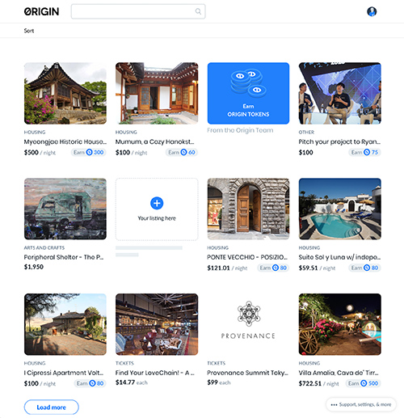

Our DApp (Decentralized Application) shows how to build a  peer to peer marketplace on the Ethereum blockchain.

You can **visit our [DApp on Mainnet](https://shoporigin.com/)** to see this in use, or check the [source on github](https://github.com/OriginProtocol/origin/tree/master/origin-dapp).
