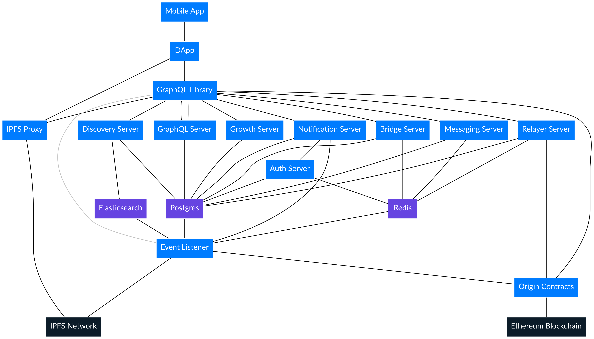

The Origin ecosystem builds from blockchain and IPFS data to provide the speed and features that enable real user growth and fast application development.

### Software Systems

- **[DApp](dapp)** - Example DAPP built on the Origin Protocol
- **[GraphQL Server](graphql-server)** - Fast access to Origin data over GraphQL
- [Event Listener](event-listener) - Stream Origin events and data to other systems
- [Discovery Server](discovery-server) - Search Origin listings
- [Notification Server](notification-server) - Live in browser notification of Origin events
- [Bridge Server](bridge-server) - verifies identity attestations usings third parties
- [Relayer](relayer) - Pays for gas on behalf of users
- [Messaging](messaging) - Persistant storage of Origin messaging
- [IPFS Proxy](ipfs-proxy) - Anti-abuse IPFS proxy
- [Testnet Faucet](faucet) - Handing out testnet OGN tokens on testnet